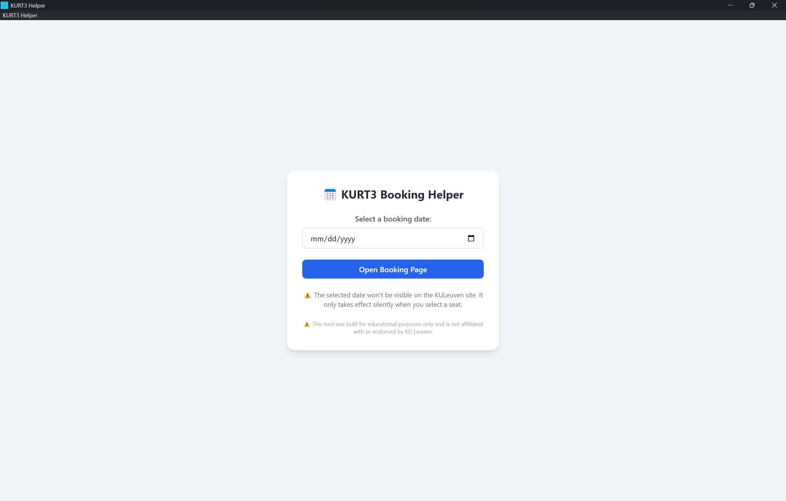

# KURT3 Helper

A small desktop helper tool built with Electron to make the KULeuven KURT3 booking system slightly easier to use by pre-filling the booking date.



## ⚠️ Disclaimer

This tool was created purely for **educational purposes**. It is **not affiliated with** or **endorsed by** KU Leuven or its IT systems. Use it responsibly and at your own risk.

## 💻 Features

- Simple date picker UI
- Automatically injects the selected date when navigating to KURT3 booking pages
- Built with Electron and TailwindCSS

## 🚀 Getting Started

### Prerequisites

- [Node.js](https://nodejs.org/) (v16+)
- [npm](https://www.npmjs.com/)

### Install and Run

```bash
npm install
npm start
```

### Build

```bash
npm run build
```

This will create a distributable version for your platform (Windows/Linux/macOS).

## 📁 Structure

- `main.js` — Main Electron process
- `preload.js` — Secure API bridge for renderer
- `renderer.js` — Frontend logic
- `index.html` — Main GUI interface

## 📦 Packaging

Uses [electron-builder](https://www.electron.build/) for cross-platform builds.

## License

MIT (or specify your license)

---

**Made by [Matse Van Horebeek](https://github.com/matse2005)**
